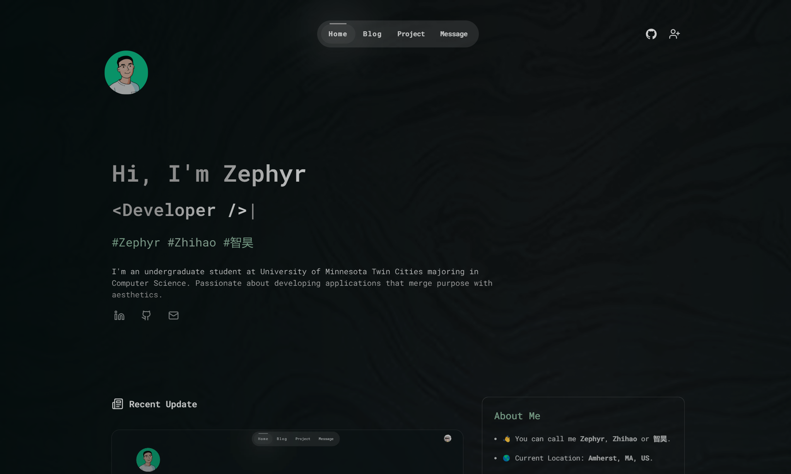
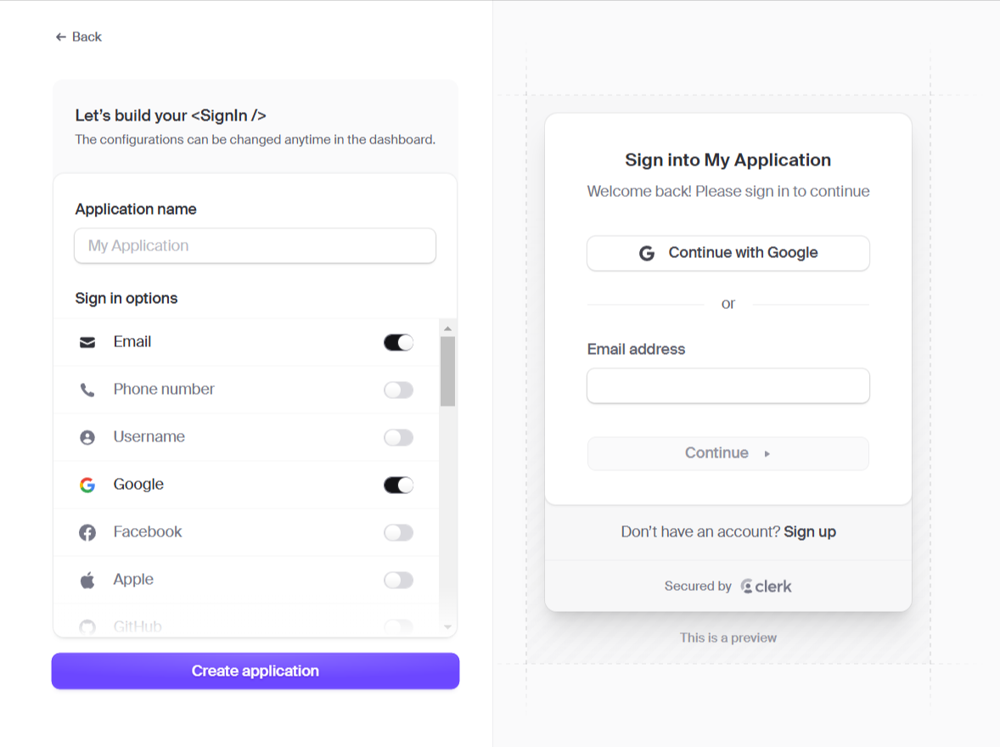
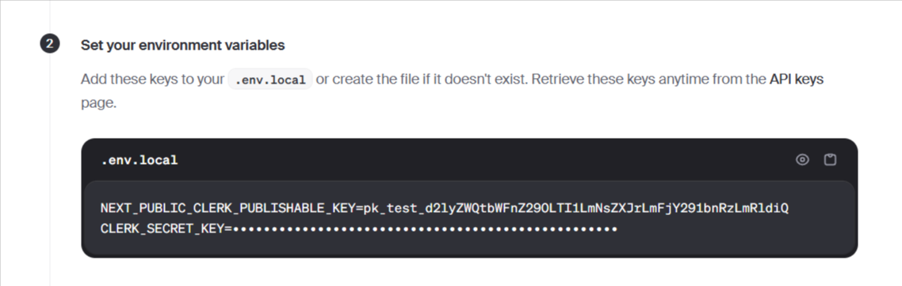
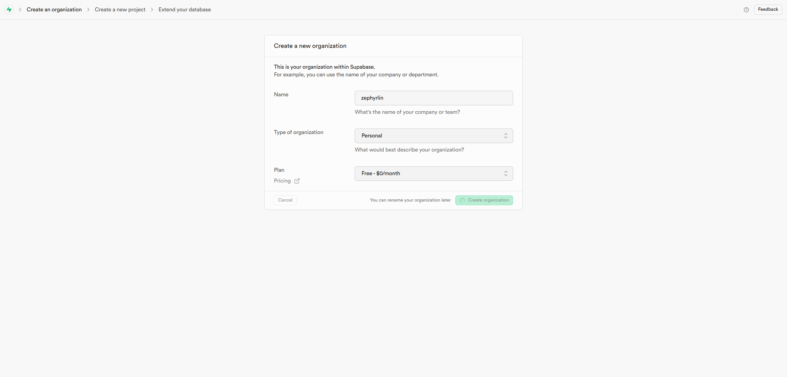
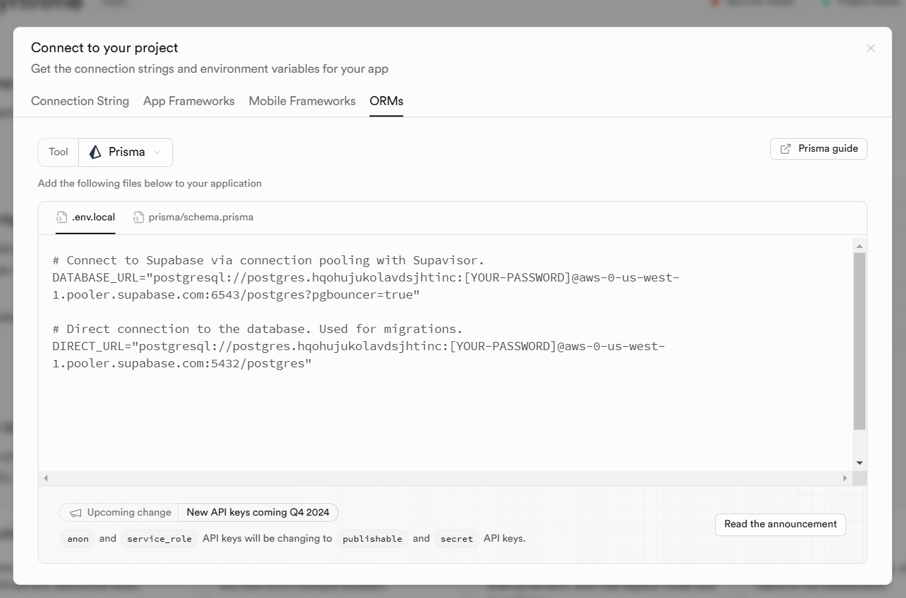
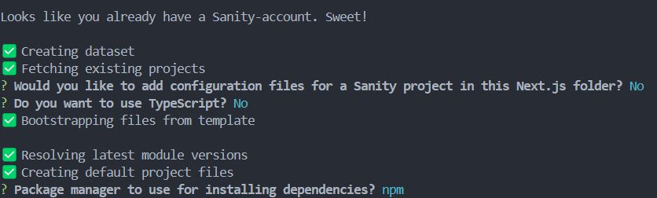
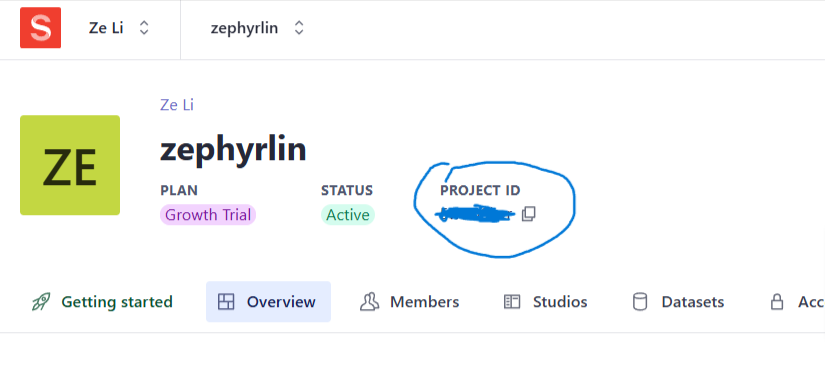

<h1 align="center">zephyrlin.me</h1>

<p align="center"><a href="./public/docs/README_CN.md">简体中文</a></p>

<p align="center">A personal website for developers</p>

<p align="center">
  
  
  
</p>



## ⚙️ Tech Stacks

- Framework: **React + Next.js**
- Styling: **Tailwind CSS** + **Shadcn UI**
- Animation: **Framer Motion**
- Database: **Supabase**
- ORM: **Prisma**
- Session Caching: **Upstash Redis**
- CMS: **Sanity**
- Authentication: **Clerk**
- Deployment: **Vercel**

## 💡Get Started

### Environment

- [Node.js 18.18](https://nodejs.org/) or later.

### Clone the repository:

```bash
git clone https://github.com/eurooooo/zephyrlin.me.git
cd zephyrlin.me
```

### Install dependencies:

```bash
npm install
```

### .env file

Create a .env file in the root directory with the following:

```
# clerk
NEXT_PUBLIC_CLERK_PUBLISHABLE_KEY=
CLERK_SECRET_KEY=

# supabase
DATABASE_URL=
DIRECT_URL=

# sanity
NEXT_PUBLIC_SANITY_ID=

# upstash redis
UPSTASH_REDIS_REST_URL=
UPSTASH_REDIS_REST_TOKEN=

# spotify
SPOTIFY_CLIENT_ID=
SPOTIFY_CLIENT_SECRET=
SPOTIFY_REDIRECT_URI=
SPOTIFY_REFRESH_TOKEN=
```

Now we need to set all the environment variables.

#### Clerk

1. Go to [Clerk website](https://clerk.com/) and create an application. Select google and github as sign in options:
   
2. Copy paste the environment variables to .env file
   

#### Supabase

1. Go to [Supabase](https://supabase.com/). Create a new project. **Important:** store the password here somewhere as you will be using it in the 3rd step. Wait a few minutes for supabase to set up the project.
   
2. Click "connect" on the right top corner and select ORMs:
   
3. Copy paste the environment variables to .env file. Replace the placeholder for password to the password you stored in the 1st step.

4. In terminal run:

```bash
npx prisma db push
```

#### Sanity

1. Create an Sanity account and sign in.
2. In terminal, run the following command. You can replace "zephyrlin.me" with another name.

```bash
npm create sanity@latest -- --template clean --create-project "zephyrlin.me" --dataset production  --output-path sanity
```

3. Then you will probably be asked to sign in. After you sign in, follow the instructions:
   

4. Go to /sanity/schemaTypes folder. Paste the following code to index.js:

```javascript
import { projectsType } from "./project";

export const schemaTypes = [projectsType];
```

In the same folder, add a file named "project.js":

```javascript
import { defineField, defineType } from "sanity";

export const projectsType = defineType({
  name: "project",
  title: "Project",
  type: "document",
  fields: [
    defineField({
      name: "title",
      type: "string",
      validation: (Rule) => Rule.required(),
    }),
    defineField({
      name: "image",
      type: "image",
      validation: (Rule) => Rule.required(),
    }),
    defineField({
      name: "description",
      type: "text",
      validation: (Rule) => Rule.required(),
    }),
    defineField({
      name: "link",
      type: "url",
      validation: (Rule) => Rule.required(),
    }),
    defineField({
      name: "tags",
      type: "array",
      of: [{ type: "string" }],
      validation: (Rule) => Rule.required().min(1),
    }),
  ],
});
```

5. Go to [sanity website](https://www.sanity.io/manage) to get project id and assign it to NEXT_PUBLIC_SANITY_ID in .env file.
   
6. In terminal run the following:

```bash
cd sanity
npm run dev
```

7. Navigate to [localhost:3333](http://localhost:3333), now you can add projects to the website.

#### Spotify

This feature is newly added, I will write instructions to set it up soon. For now you can just comment out "Spotify" component in /page.js to prevent errors.

### Run the server

🎉 Congratulations! Now we can finally run the website:

```bash
npm run dev
```

Navigate to [localhost:3000](http://localhost:3000) to see the website in action.

## Acknowledgements

- The website is inspired by [cali.so](https://cali.so/).
- Thanks **Zhixuan** for designing the background image and gradient.
