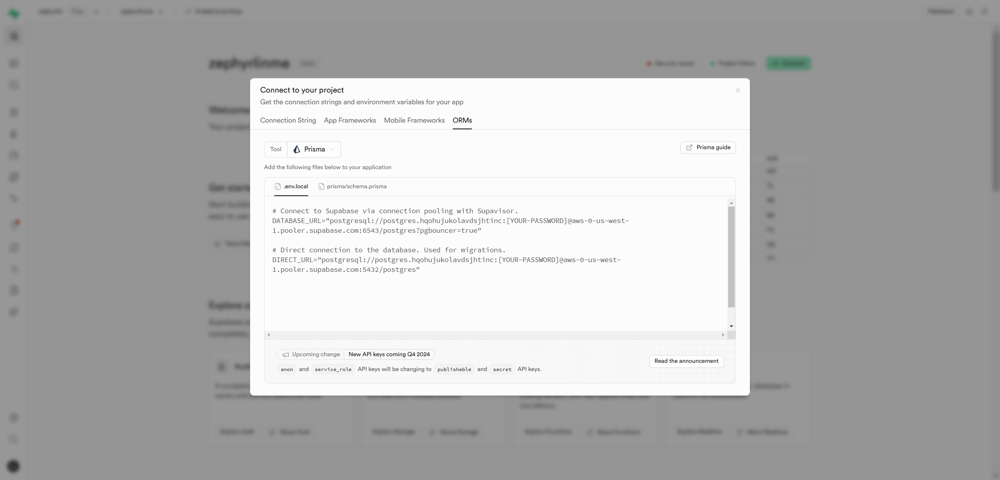

# zephyrlin.me

A personal website built with Next.js

<!--  -->

## ⚙️ Tech Stacks

- Framework: **React + Next.js**
- Styling: **Tailwind CSS** + **Shadcn UI**
- Animation: **Framer Motion**
- Database: **Supabase**
- ORM: **Prisma**
- CMS: **Sanity**
- Authentication: **Clerk**
- Deployment: **Vercel**

## 💡Get Started

### Environment

- [Node.js 18.18]("https://nodejs.org/") or later.

### Clone the repository:

```bash
git clone https://github.com/eurooooo/zephyrlin.me.git
cd zephyrlin.me
```

### Install dependencies:

```bash
npm install
```

### .env file

Create a .env file in the root directory with the following:

```
# clerk
NEXT_PUBLIC_CLERK_PUBLISHABLE_KEY=
CLERK_SECRET_KEY=

# supabase
DATABASE_URL=
DIRECT_URL=

# sanity
NEXT_PUBLIC_SANITY_ID=
```

Now we need to set all the environment variables.

#### Clerk

1. Go to [Clerk website](https://clerk.com/) and create an account.
2. Create an application, select google and github as sign in options:
   
3. Scroll down you should see:
   
4. copy paste the environment variables to .env file.

#### Supabase

1. Go to [Supabase](https://supabase.com/) and sign in or create an account.
2. If this is your first time signing in, you will need to create a organization :
   
3. Create a new project. **important:** store the password here somewhere as you will be using it in the 5th step.
   
   Wait a few minutes for supabase to set up the project.
4. Click "connect" on the right top corner and select ORMs:
   
5. Copy paste the environment variables to .env file. Replace the placeholder for password to the password you stored in the 3th step.

#### Sanity

### Run the development server

```bash
npm run dev
```

Navigate to http://localhost:3000 to see the website in action.
